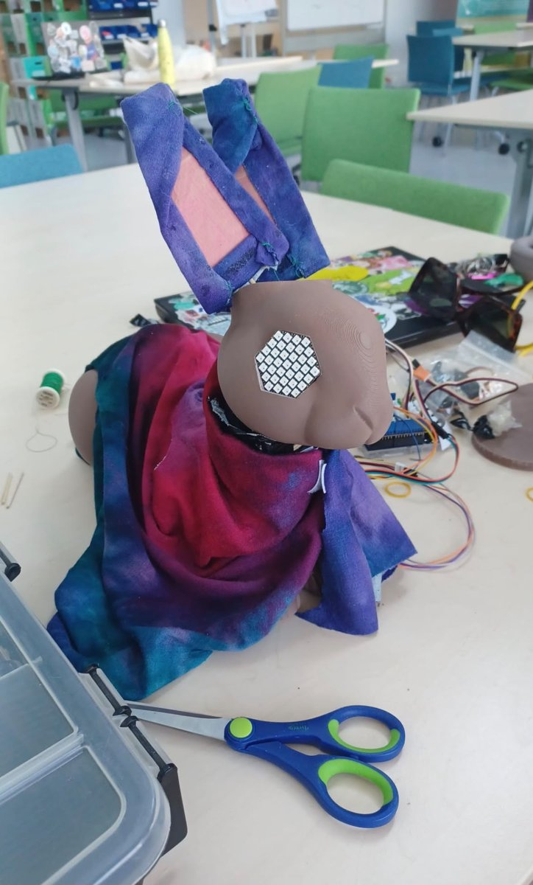
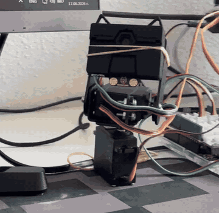
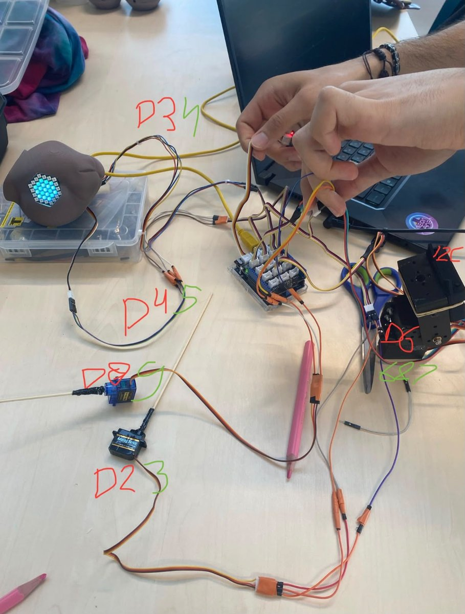

# Social Robot Bunny

A social robot for hospital settings, built by a team of four for the Human-Robot Communication course at the University of Twente (2026).

The robot looks like a bunny. It follows a person's face with its head, shows emotions with LED eyes and moving ears, and answers with beeps instead of words, similar to R2-D2. The idea is that a patient can understand how the robot "feels" without it pretending to be a human.

<p align="center">
  
  
</p>

## How it works

1. The robot records what the person says and turns it into text with Google Speech Recognition.
2. Dialogflow detects what the person means and how they feel (happy, neutral, angry, sad, scared, a question or a greeting).
3. The robot chooses its own reaction. It does not copy the user: if someone is sad, angry or scared, it reacts in a calm, comforting way and can guide them into a short breathing exercise.
4. The answer is played as beeps (`beep_speech.py`). Every word becomes one beep. The pitch, speed and type of sound depend on the emotion, and the pitch follows the sentence: it goes up at the end of a question and down at the end of a statement.
5. Python sends the emotion to the Arduino over serial, and the Arduino drives the eyes, ears and head.
6. A HuskyLens camera on a pan-tilt servo head detects faces, so the robot keeps looking at the person in front of it.

## Hardware

- Arduino UNO with a Grove shield
- HuskyLens AI camera on a pan-tilt servo head
- Servos for the ears
- NeoPixel LED matrices for the eyes
- Speaker
- 3D-printed head and a fabric body

<p align="center"></p>

## Running it

Install the Python packages:

```
pip install SpeechRecognition google-cloud-dialogflow python-dotenv pygame pyserial numpy scipy
```

Create a `.env` file with your own Dialogflow settings. Do not commit this file.

```
CREDENTIAL_PATH=path/to/your-service-account.json
PROJECT_ID=your-dialogflow-project
SESSION_ID=any-session-id
LANGUAGE=en
```

Upload the Arduino sketch to the board, set the COM port in `HRC.py`, and run `python main.py`.

## Team

Alexander, Emma, Anna and Madeleine.

My part (Alexander Kralev): the speech and sound side (speech recognition, linking Dialogflow emotions to the robot's reactions, and the beep speech), the face tracking with the HuskyLens camera, and work on the Arduino code and the hardware, including the pan-tilt head.

`huskylib.py` is DFRobot's HuskyLens Python library and is included unchanged.
